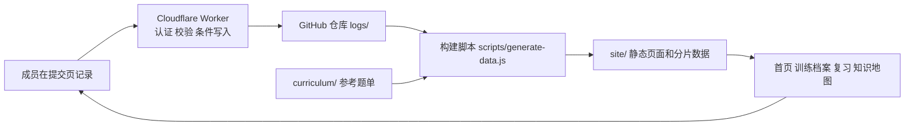

# 设计：从一次训练走到下一次尝试

版本：2026-09-29。产品优先级见 [PRODUCT.md](PRODUCT.md)；本文描述用户流程与系统分工。标有“目标”的交互仍待实现。

## 用户流程

| 阶段 | 当前可用 | 目标体验 |
| --- | --- | --- |
| 选题 | 知识地图、课程题单、标签、同题详情 | 个人 20–30 题清单；完整课程库作参考 |
| 开始训练 | `/submit/` 支持一次填写多题，首页可浏览记录 | 从个人清单或到期复习直接进入本次训练 |
| 记录 | 每题可写结果、自评、失误、心得、代码等；按日期保存 | 空心得保留为空；给简短提示并允许跳过 |
| 复习 | `/review/` 分开展示待复习、超纲待做和已归档，详情可单题改状态 | 满足信号时表单直接安排 +3 天；未完成题可改为超纲待做，退出近期队列 |
| 重做 | 同题聚合与历史记录可查看 | 从队列开始一次新尝试，并串联日期、结果和复盘 |

目标流程允许一场比赛后批量补录。复习日期是提醒，不是完成期限。系统应区分“做题结果”“掌握自评”“是否有失误”“复习安排”，不能用一个状态代替四种事实。

## 页面与信息层级

- **首页**：近期训练和应处理的复习题优先；提供进入提交页的路径。目标版本增加本次训练与个人清单入口。
- **提交页 `/submit/`**：一次训练的输入位置。题目正文、代码与心得属于每题；训练区间属于当日记录。目标版本把复盘提示放在心得字段附近，默认复习建议可见且可改。
- **复习页 `/review/` 与题目详情**：现有队列列出待复习；详情页提供单题状态操作。目标版本让“开始重做”生成新尝试，再把本次结果与上次对照。
- **知识地图、标签与训练档案**：保留检索与回看价值。目标版本只为个人小清单显示完成率，完整课程目录显示覆盖数，避免把 2857 题当个人承诺。

## 数据与系统职责

`logs/` 是已上线训练记录的权威来源，按 `logs/<成员目录>/YYYY/MM/DD/` 保存；`config/members.json` 把 GitHub 数字 ID、稳定成员 ID 与日志目录绑定。`site/` 是可重建的发布产物，页面阅读构建后的数据分片，保存由 Worker 写回仓库，构建与发布后才会反映在静态页面上。前端暂不能把“保存成功”和“站点已更新”混为一谈。

代码职责：`src/` 是浏览器入口与样式；`lib/` 放前端、构建器和 Worker 共享的日志、学习状态、题目身份与渲染规则；`workers/oauth.mjs` 处理入口、会话与鉴权，`workers/routes/` 接 HTTP 路由，`workers/services/` 处理领域操作，`workers/storage/` 处理 GitHub 访问；`scripts/` 构建站点与校验数据；`bot/` 为独立 QQ 入口。目录规则与历史理由见[归档的目录契约](archive/2026-09-28-pre-rewrite/REPOSITORY-STRUCTURE.md)。

## 拟议变更的设计约束

1. **空内容**：空心得在存储里保持空值或无文件，页面使用提示文字表达缺失，不把提示写进正文。清理旧占位文件时按精确内容匹配，先备份、记录数量与回退办法。
2. **复习建议**：仅对新提交记录应用；判断顺序为用户显式选择优先、其次根据信号给建议、最后保持不安排。信号为失误或 `outcome` 属于 `hinted`、`editorial`、`unfinished`。日期以记录日加三天为初始值，服务端按 UTC+8 校验；修改复习状态仍使用单题命令。
3. **个人小清单**：先定义题目身份和成员所有权；去重沿用共享题号归一规则。成员可删除或更换目标，进度只在这份小清单内计算。完整课程数据不迁移、不删除。
4. **重做历史**：不能改写或覆盖旧尝试来表示新结果。需有稳定题目身份、独立尝试时间和原始结果；同题聚合只是展示，不等同于单个事件源。
5. **度量**：先做构建期使用报告，统计由源数据推导的事实；无法从日志推导的点击、放弃保存等行为保持“未知”，不得估算成 0。

## 发布与回退

Worker 与 Pages 分别由 Cloudflare Workers Builds 和 GitHub Actions 监听 `main` 推送自动发布。**Worker 在没有改动的推送里不重建**：Pages 上传前始终检查线上 Worker 能否接受本站日志 schema 与匿名 `/api/session`，不兼容立即拒绝；只有本次推送动到 Worker 输入时，才额外要求 `/api/capabilities` 的 `buildCommit` 等于本次提交并最多等待 15 分钟。2026-09-28 的 `66f25b4` 已完成 Worker 与 Pages 发布，线上预检允许 `PATCH`；2026-09-29 的 `70042ea` 只改 CI 与测试，Pages 发布成功且没有触发 Worker 重建。新日志格式或写入协议仍需先保证 Worker 向后兼容，并按需运行本地浏览器回归；日常 Action 只运行快速验证与构建。门禁仅覆盖上述检查，不代替写入协议测试。更完整的操作见 [SPECIFICATION.md](SPECIFICATION.md)。
